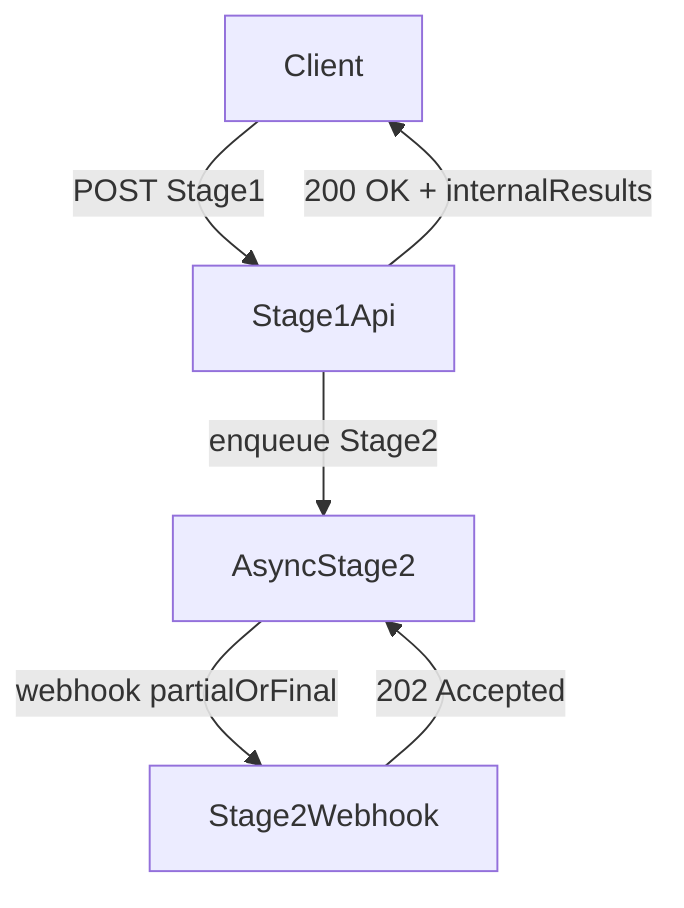
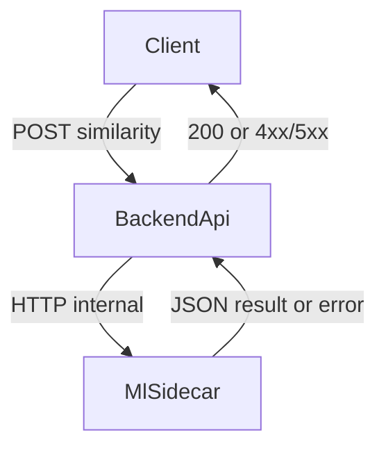

# API и контракты интеграции

Документ фиксирует прикладные HTTP-контракты для backend API сервиса проверки неймингов.
Он дополняет архитектурные материалы и описывает payload-модели, статусы обработки и ошибки
в терминах интеграции.

## Общий поток



## Эндпоинты

| Method | Path | Назначение |
| --- | --- | --- |
| `POST` | `/api/v1/registration-check` | Синхронный Stage 1 для проверки возможности регистрации |
| `POST` | `/api/v1/text-infringement` | Синхронный Stage 1 для попарной текстовой проверки нарушения |
| `POST` | `/api/v1/logo-comparison` | Синхронный Stage 1 для сравнения логотипов по placeholder-контракту |
| `POST` | `/api/v1/logo-similarity/search` | Прокси-поиск похожих логотипов через `visual-model-service` |
| `POST` | `/api/v1/text-similarity/search` | Прокси-поиск похожих названий через `text-model-service` |
| `POST` | `/api/v1/webhooks/stage2-results` | Приём частичных или финальных результатов Stage 2 |

## Прокси к ML sidecar

Ручки `/logo-similarity/search` и `/text-similarity/search` не участвуют в Stage 2 webhook-контуре и
возвращают синхронный ответ напрямую из соответствующего sidecar.



## Общие статусы и каналы

### `ProcessingStatus`

| Значение | Смысл |
| --- | --- |
| `accepted` | запрос или batch принят, дальнейшая обработка продолжается |
| `completed` | синхронный Stage 1 завершён и внутренний результат готов |
| `partial` | Stage 2 прислал только часть внешних результатов |
| `failed` | обработка завершилась ошибкой и требует анализа |

### `DeliveryChannel`

| Значение | Смысл |
| --- | --- |
| `webhook` | доставка Stage 2 выполняется только через webhook |

## Общая модель ошибки

Все бизнес-ответы об ошибках выравниваются по единому envelope:

```json
{
  "status": "error",
  "error": {
    "code": "invalid_input",
    "message": "At least one Nice class is required.",
    "context": {
      "field": "mktu_codes",
      "details": {
        "reason": "empty_list"
      }
    }
  }
}
```

### `ErrorCode`

| Значение | Когда использовать |
| --- | --- |
| `invalid_input` | бизнес-валидация payload не пройдена |
| `validation_error` | схема запроса не прошла API-валидацию |
| `conflict` | конфликт текущего состояния обработки или дедупликации |
| `internal_error` | непредвиденный сбой backend |

### HTTP-статусы ошибок

| Status | Значение |
| --- | --- |
| `400` | payload синтаксически корректен, но нарушает прикладные правила |
| `409` | конфликт по состоянию обработки |
| `422` | schema validation error на уровне API |
| `500` | внутренняя ошибка сервиса |

## `POST /api/v1/registration-check`

Возвращает внутренний результат Stage 1 синхронно и сообщает, что внешний Stage 2 будет
доставлен отдельно в webhook-контур.

### Request

```json
{
  "naming": "PROBIMAX",
  "mktu_codes": [5, 25]
}
```

### Response `200 OK`

```json
{
  "request_id": "reg-probimax-001",
  "flow": "registration_check",
  "status": "completed",
  "naming": "PROBIMAX",
  "mktu_codes": [5, 25],
  "internal_results": [
    {
      "candidate_id": "tm-001",
      "candidate_name": "PROBI MAX",
      "source": "trademark_db",
      "mktu_codes": [5, 25],
      "similarity": 91.4,
      "summary": "High phonetic overlap in the same Nice classes.",
      "similarity_breakdown": {
        "semantic": 84.0,
        "phonetic": 96.0,
        "graphic": 88.0,
        "legal": 90.0,
        "visual": null
      }
    }
  ],
  "stage2": {
    "status": "accepted",
    "delivery": "webhook",
    "correlation_id": "reg-probimax-001",
    "partial_results_allowed": true,
    "webhook_path": "/api/v1/webhooks/stage2-results"
  },
  "meta": {
    "internal_result_count": 1,
    "result_limit": 200,
    "stage2_enabled": true
  }
}
```

## `POST /api/v1/text-infringement`

Сравнивает защищаемый нейминг и спорное обозначение, возвращает pairwise similarity и
внутренний shortlist.

### Request

```json
{
  "protected_naming": "PROBIMAX",
  "suspicious_naming": "PROBI MAX",
  "mktu_codes": [5]
}
```

### Response `200 OK`

```json
{
  "request_id": "txt-probi-max-001",
  "flow": "text_infringement",
  "status": "completed",
  "protected_naming": "PROBIMAX",
  "suspicious_naming": "PROBI MAX",
  "mktu_codes": [5],
  "pair_similarity": 94.2,
  "internal_results": [
    {
      "candidate_id": "tm-002",
      "candidate_name": "PROBI MAX",
      "source": "trademark_db",
      "mktu_codes": [5],
      "similarity": 94.2,
      "summary": "Pairwise comparison found the same dominant verbal core.",
      "similarity_breakdown": {
        "semantic": 82.0,
        "phonetic": 98.0,
        "graphic": 93.0,
        "legal": 95.0,
        "visual": null
      }
    }
  ],
  "stage2": {
    "status": "accepted",
    "delivery": "webhook",
    "correlation_id": "txt-probi-max-001",
    "partial_results_allowed": true,
    "webhook_path": "/api/v1/webhooks/stage2-results"
  },
  "meta": {
    "internal_result_count": 1,
    "result_limit": 200,
    "stage2_enabled": true
  }
}
```

## `POST /api/v1/logo-comparison`

Текущий контракт фиксирует только placeholder-структуру для передачи логотипов. Окончательный
формат бинарных данных будет уточнён отдельно.

### Request

```json
{
  "reference_logo": {
    "asset_ref": "logo://protected/probimax-main",
    "media_type": "image/png",
    "filename": "probimax.png"
  },
  "suspicious_logo": {
    "asset_ref": "logo://suspicious/probi-market",
    "media_type": "image/png",
    "filename": "probi-market.png"
  },
  "mktu_codes": [35],
  "notes": "Placeholder contract until final binary transport is approved."
}
```

## `POST /api/v1/logo-similarity/search`

Передаёт файл изображения в `visual-model-service` и возвращает top-K похожих логотипов по
предвычисленным эмбеддингам.

### Request

`multipart/form-data`:

- `file`: бинарный файл (`png/jpeg/webp/...`)
- query param `top_k` (`integer >= 1`, опционально, по умолчанию 10)

### Response `200 OK`

```json
{
  "top_k": 2,
  "matches": [
    {
      "logo_path": "data/logos/a.jpg",
      "cosine_similarity": 0.9,
      "similarity_percent": 90.0
    },
    {
      "logo_path": "data/logos/b.jpg",
      "cosine_similarity": 0.8,
      "similarity_percent": 80.0
    }
  ]
}
```

### Типичные ошибки

| Status | Когда возникает |
| --- | --- |
| `400` / `413` / `422` | некорректный файл или payload |
| `502` | sidecar недоступен или вернул неожиданный статус |
| `503` | sidecar запущен, но не готов (модель/эмбеддинги не загрузились) |
| `504` | таймаут запроса к sidecar |

## `POST /api/v1/text-similarity/search`

Передаёт JSON-запрос в `text-model-service` и возвращает top-K похожих названий из текстового индекса.

### Request

```json
{
  "query": "EUROPLEX",
  "mktu_codes": [5, 35],
  "top_k": 10
}
```

### Response `200 OK`

```json
{
  "top_k": 2,
  "matches": [
    {
      "name_clean": "europlex",
      "name_display": "EUROPLEX",
      "mark_significant": "EUROPLEX",
      "certificate_link": "https://example.org/cert",
      "mktu_codes": [5],
      "cosine_similarity": 0.92,
      "similarity_percent": 92.0
    },
    {
      "name_clean": "euro plax",
      "name_display": "EURO PLAX",
      "mark_significant": "EURO PLAX",
      "certificate_link": "",
      "mktu_codes": [35],
      "cosine_similarity": 0.84,
      "similarity_percent": 84.0
    }
  ]
}
```

### Типичные ошибки

| Status | Когда возникает |
| --- | --- |
| `400` / `422` | пустой `query` или некорректный JSON payload |
| `502` | sidecar недоступен или вернул неожиданный статус |
| `503` | sidecar запущен, но не готов (артефакты или модель не смонтированы) |
| `504` | таймаут запроса к sidecar |

### Response `200 OK`

```json
{
  "request_id": "logo-probimax-main-001",
  "flow": "logo_comparison",
  "status": "completed",
  "reference_logo": {
    "asset_ref": "logo://protected/probimax-main",
    "media_type": "image/png",
    "filename": "probimax.png"
  },
  "suspicious_logo": {
    "asset_ref": "logo://suspicious/probi-market",
    "media_type": "image/png",
    "filename": "probi-market.png"
  },
  "mktu_codes": [35],
  "internal_results": [
    {
      "candidate_id": "logo-001",
      "candidate_name": "Internal similar visual mark",
      "source": "trademark_db",
      "mktu_codes": [35],
      "similarity": 88.6,
      "summary": "Similar visual silhouette and retained text element.",
      "similarity_breakdown": {
        "semantic": null,
        "phonetic": null,
        "graphic": null,
        "legal": 85.0,
        "visual": 88.6
      }
    }
  ],
  "comparison_summary": "Placeholder Stage 1 response with internal logo matches.",
  "stage2": {
    "status": "accepted",
    "delivery": "webhook",
    "correlation_id": "logo-probimax-main-001",
    "partial_results_allowed": true,
    "webhook_path": "/api/v1/webhooks/stage2-results"
  },
  "meta": {
    "internal_result_count": 1,
    "result_limit": 200,
    "stage2_enabled": true
  }
}
```

## `POST /api/v1/webhooks/stage2-results`

Принимает частичные или финальные batch-обновления асинхронного Stage 2. Контракт допускает
unordered delivery и несколько batch-ов по одному `correlation_id`.

### Request

```json
{
  "correlation_id": "reg-probimax-001",
  "flow": "registration_check",
  "status": "partial",
  "naming": "PROBIMAX",
  "mktu_codes": [5, 25],
  "partial": true,
  "matches": [
    {
      "candidate_id": "ext-001",
      "candidate_name": "Probimax Mobile",
      "source": "google_play",
      "mktu_codes": [9],
      "similarity": 81.0,
      "summary": "Found in external store search.",
      "similarity_breakdown": {
        "semantic": 77.0,
        "phonetic": 86.0,
        "graphic": null,
        "legal": null,
        "visual": null
      }
    }
  ],
  "source_batch": ["google_play"]
}
```

### Response `202 Accepted`

```json
{
  "status": "accepted",
  "delivery": "webhook",
  "processing_status": "accepted",
  "correlation_id": "reg-probimax-001",
  "partial": true,
  "use_case": "WebhookCallbackProcessingUseCase"
}
```

## Поля результата

### `MatchCandidate`

| Поле | Тип | Смысл |
| --- | --- | --- |
| `candidate_id` | `string` | стабильный идентификатор кандидата |
| `candidate_name` | `string` | отображаемое имя найденного обозначения |
| `source` | `string` | источник кандидата, например `trademark_db` или внешний каталог |
| `mktu_codes` | `integer[]` | классы МКТУ, связанные с кандидатом |
| `similarity` | `number` | итоговый score `0..100` |
| `summary` | `string?` | короткое объяснение совпадения |
| `similarity_breakdown` | `object?` | детализация score по типам сходства |

## Замечания по совместимости

- Stage 1 контракты описывают синхронный внутренний результат, а не финальный merged output.
- Stage 2 доставляется только через webhook и может быть частичным.
- Для `logo comparison` `asset_ref` считается временным placeholder-полем до утверждения
  окончательного file transport.
- Ручки `logo-similarity/search` и `text-similarity/search` зависят от доступности соответствующих
  sidecar-контейнеров и корректно смонтированных модельных артефактов на хосте.
- Доменные объекты backend описаны отдельно и маппятся в контракт через адаптерный слой:
  [domain_model.md](domain_model.md).
