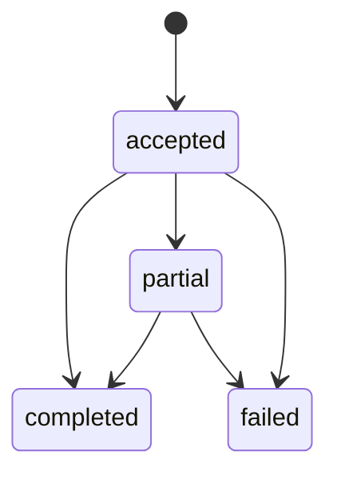

# Domain Model

## Соответствие текущему backend (MVP тестового стенда)

Публичное API сейчас **не** создаёт агрегат `CheckRequest` по HTTP. Вместо этого backend выступает **прокси**:

- **Logo similarity**: multipart-запрос → `visual-model-service` → JSON с `logo_path` и score; опционально превью через прокси (`GET /asset` на sidecar).
- **Text similarity**: JSON-запрос → `text-model-service` → JSON с кандидатами.
- **Stage2 webhook**: точка приёма асинхронных батчей по уже зафиксированному контракту (`Stage2WebhookRequest`); оркестрация внешнего контура из этого API **не инициируется**.

Доменные сущности в этом контуре минимальны: по сути **запрос-ответ** и **валидация транспорта**; богатая модель ниже относится к **целевому** продукту.

---

## Целевая DDD-модель (Stage1 сценарии + Stage2)

Документ ниже фиксирует DDD-first модель для трёх **продуктовых** Stage1 сценариев:

- `registration_check`
- `text_infringement`
- `logo_comparison`

Модель ориентирована на единый жизненный цикл запроса (`CheckRequest`) и общий формат результата (`ConflictResultSet`) с поддержкой async Stage 2.

## 1. Aggregates и Entities

### 1.1 `CheckRequest` (Aggregate Root)

Отвечает за жизненный цикл проверки и связывает:

- входные данные сценария;
- статус Stage 1;
- статус Stage 2;
- `correlation_id` для webhook.

Поля:

- `request_id: str`
- `flow: FlowType` (`registration_check`, `text_infringement`, `logo_comparison`)
- `status: ProcessingStatus`
- `mktu_codes: MktuClassSet`
- `naming_payload: NamingPair | SingleNaming | LogoPair`
- `created_at`, `updated_at` (для backend state tracking)

Инварианты:

- `request_id` не пустой и стабилен после создания.
- `flow` определяет обязательный тип `naming_payload`.
- `status` может переходить только по разрешенным переходам.

### 1.2 `ConflictResultSet`

Результат Stage 1 или merged Stage 1/2.

Поля:

- `request_id: str`
- `candidates: list[MatchCandidate]`
- `result_limit: int` (по умолчанию 200)
- `partial: bool`

Инварианты:

- `len(candidates) <= result_limit`
- `candidates` отсортированы по `similarity.total` по убыванию.

### 1.3 `Stage2Job`

Представление async-задачи для внешнего обогащения.

Поля:

- `correlation_id: str`
- `dedup_key: str`
- `delivery: DeliveryChannel` (`webhook`)
- `partial_results_allowed: bool`

Инварианты:

- `dedup_key` строится по нормализованной схеме `naming + sorted(MKTU)`.
- `delivery` фиксирован как `webhook` в текущем контракте.

## 2. Value Objects

### 2.1 `NamingText`

- `raw: str`
- `canonical: str`

Правила:

- `canonical` = whitespace-normalized + casefold.
- пустые строки запрещены.

### 2.2 `MktuClassSet`

- уникальный, отсортированный список `int`.

Правила:

- допускаются только положительные целые;
- при нормализации удаляются дубликаты.

### 2.3 `LogoAssetRef`

- `asset_ref: str`
- `media_type: str | None`
- `filename: str | None`

Правила:

- `asset_ref` обязателен;
- доменная логика не привязана к конкретному transport protocol.

### 2.4 `SimilarityBreakdown` и `SimilarityScore`

- `SimilarityBreakdown`: `semantic`, `phonetic`, `graphic`, `legal`, `visual` (опционально).
- `SimilarityScore.total`: итоговый score `0..100`.

Правила:

- каждая метрика в диапазоне `0..100`;
- `total` обязателен для ранжирования.

### 2.5 `CandidateRef`

- `candidate_id`
- `candidate_name`
- `source`

Правила:

- все поля обязательны;
- `candidate_id` стабилен в пределах источника.

## 3. Flow-специализация

### 3.1 `registration_check`

Payload:

- `naming: NamingText`
- `mktu_codes: MktuClassSet`

Результат:

- `ConflictResultSet` с `top-N` совпадениями.

### 3.2 `text_infringement`

Payload:

- `protected_naming: NamingText`
- `suspicious_naming: NamingText`
- `mktu_codes: MktuClassSet`

Результат:

- `pair_similarity` для пары + shortlist кандидатов.

### 3.3 `logo_comparison`

Payload:

- `reference_logo: LogoAssetRef`
- `suspicious_logo: LogoAssetRef`
- `mktu_codes: MktuClassSet`

Результат:

- visual-oriented `ConflictResultSet`;
- `comparison_summary` как explanation.

## 4. Domain Policies

### 4.1 `DeduplicationPolicy`

Строит `Stage2Job.dedup_key`:

- naming нормализуется;
- MKTU сортируются и дедуплицируются;
- формат ключа: `canonical_naming|code1,code2`.

### 4.2 `RankingPolicy`

- сортировка кандидатов по `SimilarityScore.total` по убыванию;
- ограничение `result_limit`;
- стабильный tie-break по `candidate_id`.

### 4.3 `SimilarityPolicy`

- проверка диапазонов breakdown-метрик;
- расчет или валидация `total` для единообразного ранжирования.

### 4.4 `PreprocessingPolicy`

- нормализация whitespace;
- casefold;
- подготовка к dedup/ranking.

## 5. Разрешенные переходы статусов

## 6. Mapping: доменная модель → HTTP-контракты

### Webhook и общие схемы OpenAPI

Схемы `MatchCandidate`, `ProcessingStatus`, `FlowType`, ошибки и webhook по-прежнему живут в OpenAPI как **общий язык данных** между продюсером Stage2 и backend. Отображение:

- `ConflictResultSet.candidates` ↔ поля массива `matches` в webhook.
- `SimilarityBreakdown` ↔ `similarity_breakdown` у кандидата.
- Корреляция ↔ `correlation_id`, `partial` в webhook payload.

Агрегат `CheckRequest` в этом приёме может существовать только **внутри** приложения, если добавят персистентность; текущая реализация webhook может быть упрощённой.

### Целевой Stage1 REST (ещё не в публичном API)

Когда регистрация / нарушение / logo comparison вернутся как HTTP:

- `CheckRequest.request_id` → `request_id`
- `CheckRequest.flow` → `flow`
- `ConflictResultSet.candidates` → `internal_results`
- `SimilarityScore.total` → `MatchCandidate.similarity`
- и т.д., как ранее проектировалось.

### Similarity MVP (текущий JSON sidecar)

Ответы `logo-similarity/search` и `text-similarity/search` **не** маппятся на `ConflictResultSet`: это прямой прокси ответа sidecar (top-K, пути, скоры).
