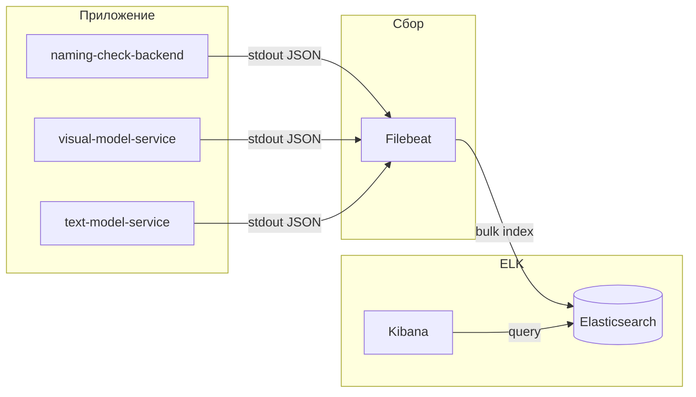

# План внедрения централизованного логирования (ELK Stack)

> **Статус**: фазы 1–2 **реализованы**; на тестовом стенде (`45.91.236.105`) **индексация и Kibana Discover работают** (2026-06-09). Фаза 3 (saved searches / дашборды) — опционально.  
> **Связанные документы**: [system_architecture.md](system_architecture.md), [backend/.github/workflows/deploy-test-stand.yml](../../backend/.github/workflows/deploy-test-stand.yml).

---

## 1. Цели

| Цель | Описание |
| --- | --- |
| **Централизация** | Собирать логи `naming-check-backend`, `visual-model-service`, `text-model-service` в одном месте вместо `docker logs`. |
| **Поиск и фильтрация** | Быстро находить ошибки, медленные запросы, сбои sidecar по полям (уровень, сервис, endpoint, `request_id`). |
| **Автозапуск Kibana при деплое** | Kibana (и зависимый Elasticsearch) поднимаются вместе с приложением на тестовом стенде и перезапускаются после ребута сервера. |
| **Соответствие NFR** | Поддержка мониторинга async-контура из ТЗ (задержки, fail rate) — на следующих этапах через дашборды и алерты в Kibana. |

**Вне scope первой итерации**: метрики (Prometheus/Grafana), distributed tracing (OpenTelemetry), прод-кластер Elasticsearch с репликацией.

---

## 2. Текущее состояние

### 2.1. Логирование в коде

| Сервис | Состояние |
| --- | --- |
| `naming-check-backend` | JSON в stdout (`json_logging.py`, `RequestLoggingMiddleware`, `X-Request-ID` в httpx-клиентах). |
| `visual-model-service` | Та же схема полей. |
| `text-model-service` | Та же схема полей. |

Формат: **структурированный JSON** с полями `service`, `level`, `message`, `request_id`, `method`, `path`, `status_code`, `duration_ms`.

### 2.2. Деплой тестового стенда

Сейчас три контейнера приложения стартуют через `docker run` в SSH-скрипте workflow `deploy-test-stand.yml`:

- сеть `naming-check-net`;
- `--restart unless-stopped`;
- sidecar-порты привязаны к `127.0.0.1` (доступ только с хоста);
- backend публикуется наружу на `:8000`.

При сбое деплоя CI уже читает `docker logs --tail N` — это **ручной** способ, не подходит для эксплуатации.

### 2.3. Ограничения среды

- Тестовый стенд — **небольшой VPS** (в workflow явно упоминаются ограничения диска и OOM).
- ТЗ требует **офлайн / внутренний контур** — образы Elastic нужно тянуть заранее или хранить в приватном registry, без runtime-зависимости от elastic.co.
- Elasticsearch требует `vm.max_map_count >= 262144` на хосте.

---

## 3. Целевая архитектура

### 3.1. Компоненты ELK (выбранный вариант)



| Компонент | Роль | Почему |
| --- | --- | --- |
| **Elasticsearch** | Хранилище и индекс логов | Ядро стека. |
| **Kibana** | UI, Discover, дашборды | Требование пользователя; автозапуск при деплое. |
| **Filebeat** | Агент сбора логов контейнеров | Легче Logstash для сценария «Docker stdout → ES»; официально поддерживается Elastic. |
| **Logstash** | *Не планируется* | Достаточно Filebeat для сценария «Docker stdout → ES». |

> **Примечание**: классический «ELK» часто дополняют Beats (EFK-подход). Для нашего случая **Elasticsearch + Filebeat + Kibana** — практичный минимум без Logstash.

### 3.2. Сеть и порты (план)

| Сервис | Порт (план) | Доступ |
| --- | --- | --- |
| Elasticsearch | `9200` | Только `127.0.0.1` или только внутри `naming-check-net` |
| Kibana | `5601` | `0.0.0.0:5601` → `http://<публичный-IP>:5601` (логин `elastic`) |
| Filebeat | — | Без публикации портов |

Все контейнеры ELK подключаются к **`naming-check-net`**, чтобы Filebeat видел логи контейнеров приложения.

### 3.3. Схема лог-сообщения (план)

Единый **JSON в stdout** (structlog или аналог в Python):

```json
{
  "@timestamp": "2026-06-03T12:00:00.000Z",
  "level": "INFO",
  "service": "naming-check-backend",
  "env": "production",
  "message": "request completed",
  "request_id": "550e8400-e29b-41d4-a716-446655440000",
  "method": "POST",
  "path": "/api/v1/logo-similarity/search",
  "status_code": 200,
  "duration_ms": 142,
  "client_ip": "10.0.0.1"
}
```

Обязательные поля для MVP логирования:

- `service`, `level`, `message`, `@timestamp`;
- для HTTP: `request_id`, `method`, `path`, `status_code`, `duration_ms`.

`request_id` прокидывается в вызовы sidecar (заголовок `X-Request-ID`) для сквозной фильтрации в Kibana.

---

## 4. Автозапуск Kibana при деплое — исследование

### 4.1. Как это работает технически

Kibana **не может** стартовать без готового Elasticsearch. Для корректного порядка запуска:

1. Elasticsearch поднимается первым с `discovery.type=single-node` (тестовый стенд).
2. **Healthcheck** Elasticsearch (`/_cluster/health` или curl с ожиданием auth).
3. Kibana стартует с `depends_on: condition: service_healthy` (Docker Compose) или эквивалентным ожиданием в shell-скрипте.
4. Filebeat стартует после ES (и желательно после приложений).

При **`restart: unless-stopped`** (или `--restart unless-stopped`) Kibana и ES автоматически поднимутся после **ребута VPS**, без повторного деплоя.

### 4.2. Рекомендуемый способ интеграции с текущим деплоем

**Вариант A (рекомендуемый): отдельный `docker compose` для ELK**

- Файл, например: `backend/infra/logging/docker-compose.elk.yml`.
- В шаге «Pull and restart containers» workflow **дополнительно**:
  1. `docker compose -f infra/logging/docker-compose.elk.yml pull`
  2. `docker compose -f infra/logging/docker-compose.elk.yml up -d`
  3. затем существующие `docker run` для приложения (или миграция приложения в общий compose — см. вариант B).

Плюсы: официальный паттерн Elastic, healthcheck + `depends_on`, проще версионировать конфиг Filebeat/Kibana.

**Вариант B: единый compose для всего стенда**

- Один `docker-compose.test-stand.yml` заменяет шесть отдельных `docker run`.
- ELK и приложение в одном файле; Kibana автоматически в составе `docker compose up -d`.

Плюсы: один источник правды. Минусы: больший рефакторинг деплоя, выше риск регрессии CI.

**Вариант C: только `docker run` для ELK (как сейчас для app)**

- Возможен, но **не рекомендуется**: порядок запуска и healthcheck придётся дублировать в bash вручную.

**Решение для документации**: начать с **варианта A**, не ломая текущий деплой приложения.

### 4.3. Пример фрагмента Compose (эскиз, не финальная конфигурация)

```yaml
services:
  elasticsearch:
    image: docker.elastic.co/elasticsearch/elasticsearch:8.17.0
    environment:
      - discovery.type=single-node
      - xpack.security.enabled=true
      - ELASTIC_PASSWORD=${ELASTIC_PASSWORD}
    volumes:
      - es-data:/usr/share/elasticsearch/data
    networks:
      - naming-check-net
    restart: unless-stopped
    healthcheck:
      test: ["CMD-SHELL", "curl -fsS http://localhost:9200/_cluster/health || exit 1"]
      interval: 10s
      timeout: 5s
      retries: 30

  kibana:
    image: docker.elastic.co/kibana/kibana:8.17.0
    depends_on:
      elasticsearch:
        condition: service_healthy
    environment:
      - ELASTICSEARCH_HOSTS=http://elasticsearch:9200
      - ELASTICSEARCH_USERNAME=kibana_system
      - ELASTICSEARCH_PASSWORD=${KIBANA_PASSWORD}
    ports:
      - "127.0.0.1:5601:5601"
    networks:
      - naming-check-net
    restart: unless-stopped

  filebeat:
    image: docker.elastic.co/beats/filebeat:8.17.0
    user: root
    volumes:
      - /var/lib/docker/containers:/var/lib/docker/containers:ro
      - /var/run/docker.sock:/var/run/docker.sock:ro
      - ./filebeat.yml:/usr/share/filebeat/filebeat.yml:ro
    depends_on:
      elasticsearch:
        condition: service_healthy
    networks:
      - naming-check-net
    restart: unless-stopped

networks:
  naming-check-net:
    external: true

volumes:
  es-data:
```

Kibana доступна после деплоя по адресу `http://<TEST_STAND_HOST>:5601` (логин `elastic`, пароль из `TEST_STAND_ELK_ENV_FILE`).

### 4.5. Filebeat: pipeline и типичные проблемы

Финальная конфигурация: `backend/infra/logging/filebeat.yml`.

| Проблема | Симптом | Решение |
| --- | --- | --- |
| Устаревший input `container` | Filebeat crash-loop | `command: ["-e", "--strict.perms=false", "-c", "/usr/share/filebeat/filebeat.yml"]`, input `filestream` |
| `add_docker_metadata` не находит контейнер | `drop_event` по `container.name` отбрасывает всё | `match_source: true`, `match_source_index: 5` (container ID в пути `/var/lib/docker/containers/<id>/...`) |
| Логи ES/Kibana/uvicorn в индексе | `output.events.dropped`, mapping conflicts | `drop_event` после `decode_json_fields`: оставлять только `service` ∈ {`naming-check-backend`, `visual-model-service`, `text-model-service`} |
| Дублирование поля `log` | Сырой JSON в Discover | `drop_fields: [log, stream, time]` после decode |

Диагностика на хосте: `bash infra/logging/scripts/diagnose-filebeat.sh`.

### 4.6. Elastic APM (трейсы)

| Компонент | Роль |
| --- | --- |
| **APM Server** (`apm-server:8200`) | Принимает события от агентов, пишет в Elasticsearch |
| **elastic-apm** (Python agent) | Транзакция на каждый HTTP-запрос, span'ы на httpx-вызовы |
| **Kibana → Observability → APM** | UI: latency, errors, waterfall по ручкам |

Включение в приложениях: `ELASTIC_APM_ENABLED=true`, `ELASTIC_APM_SERVER_URL=http://apm-server:8200`.  
JSON-логи дополняются полями `trace.id` и `transaction.id` для перехода из Discover в APM.

### 4.4. Изменения в CI/CD (план)

| Шаг | Действие |
| --- | --- |
| Bootstrap сервера | `sysctl vm.max_map_count=262144` (+ persist в `/etc/sysctl.d/`); каталог для ES data, например `/opt/elk-data`. |
| Sync | Rsync `backend/infra/logging/` на стенд вместе с backend. |
| Secrets | Новые GitHub Secrets: `ELASTIC_PASSWORD`, `KIBANA_PASSWORD` (или один `.env.elk` через secret). |
| Deploy job | После `docker network create naming-check-net` — `docker compose up -d` для ELK **до** или **параллельно** с приложением; verify — HTTP check Kibana `:5601/api/status`. |
| Verify | Опционально: post-deploy smoke — отправить тестовый запрос к backend и убедиться, что лог появился в индексе `logs-*` в Kibana Discover. |

### 4.5. Индексы и retention (план)

- Index pattern: `logs-naming-check-*` или data stream `logs-naming-check`.
- ILM policy на тестовом стенде: **retention 1 день** (удаление индексов старше 24 часов).
- Размер диска под ELK: минимальный за счёт короткого retention; мониторить свободное место на VPS.

---

## 5. Безопасность

| Тема | План |
| --- | --- |
| Аутентификация ES/Kibana | Включить `xpack.security`; пароли через secrets, не в репозитории. |
| Публикация Kibana | **Не** открывать `:5601` в интернет; только `127.0.0.1` на хосте + **SSH-туннель** (`ssh -L 5601:127.0.0.1:5601`). Reverse proxy не используем. |
| TLS | На тестовом стенде допустим HTTP внутри Docker-сети; для prod — HTTPS по официальному compose-шаблону Elastic с cert setup container. |
| Содержимое логов | Не логировать тело запросов с ПДн/файлами логотипов; только метаданные (размер, hash, path). |
| Filebeat и docker.sock | Монтирование socket — стандартная практика; доступ только root/deploy-пользователю на хосте. |

---

## 6. Требования к ресурсам (оценка)

| Компонент | RAM (ориентир) | Комментарий |
| --- | --- | --- |
| Elasticsearch (single-node) | 1–2 GB heap + overhead | `ES_JAVA_OPTS=-Xms1g -Xmx1g` минимум для стенда |
| Kibana | ~512 MB – 1 GB | |
| Filebeat | ~100–200 MB | |
| **Итого ELK** | **~2.5–4 GB** | Плюс 3 контейнера ML/backend |

**Риск**: ELK и PyTorch sidecars на **одном VPS** — следить за RAM и OOM; при нехватке памяти сначала уменьшить heap Elasticsearch, затем пересмотреть ресурсы VPS.

**Открытый вопрос**: фактические RAM/CPU тестового стенда — зафиксировать перед реализацией (размещение на том же VPS уже принято).

---

## 7. Этапы реализации

### Фаза 0 — Подготовка (текущий документ)

- [x] Зафиксировать архитектурный план и способ автозапуска Kibana.
- [x] Размещение: ELK на **том же VPS**, что backend + ML sidecars.
- [x] Версия Elastic Stack: **8.17.x** (единая для Elasticsearch, Kibana, Filebeat).

### Фаза 1 — Инфраструктура на стенде

- [x] `backend/infra/logging/docker-compose.elk.yml` + `filebeat.yml`.
- [x] Обновить `bootstrap-test-stand-ubuntu.sh` (`vm.max_map_count`, каталоги).
- [x] Расширить `deploy-test-stand.yml`: sync + `compose up` + verify Kibana.
- [x] GitHub Secrets для паролей ELK (`TEST_STAND_ELK_ENV_FILE`).

### Фаза 2 — Структурированные логи в приложениях

- [x] Единый JSON-логгер в `naming-check-backend` (middleware: request_id, duration, status).
- [x] Привести sidecars к той же схеме полей.
- [x] Прокидывание `X-Request-ID` backend → sidecars.

### Фаза 3 — Kibana UX

- [x] Data view `logs-naming-check-*` + Discover по умолчанию (`setup-kibana.sh`).
- [ ] Saved searches: ошибки, 5xx, медленные запросы (`duration_ms > 3000`).
- [ ] Базовый дашборд: RPS, error rate, latency p95 по сервисам.
- [x] **Elastic APM**: APM Server + `elastic-apm` agent; транзакции по HTTP-ручкам, span'ы httpx между сервисами; `trace.id` в логах.

### Фаза 4 — Алерты (связь с NFR ТЗ)

- [ ] Kibana alerting / Watcher: fail rate async webhook, задержка > 5 мин (когда появится async-контур).
- [ ] Уведомления в Telegram/email — по согласованию с командой.

---

## 8. Локальная разработка

Для разработчиков без доступа к тестовому стенду:

- Скрипт `backend/scripts/start-elk-local.sh` на базе [elastic/start-local](https://github.com/elastic/start-local) **или** тот же `docker-compose.elk.yml` с пониженным heap.
- Backend/sidecars локально пишут JSON в stdout; Filebeat подхватывает через Docker Desktop.
- Kibana: `http://localhost:5601`.

Локальный ELK **не** коммитить с паролями; `.env.elk.example` в репозитории.

---

## 9. Альтернативы (рассмотрены, не выбраны)

| Вариант | Плюсы | Минусы |
| --- | --- | --- |
| **Grafana Loki** | Легче по ресурсам | Не ELK; другой UI (Grafana). |
| **OpenSearch + Dashboards** | Apache 2.0, форк ES | Расхождение с заявленным ELK. |
| **Только `docker logs` + Loki** | Простота | Нет Kibana «из коробки». |
| **Elastic Cloud** | Managed | Противоречит офлайн-контуру ТЗ. |

---

## 10. Принятые решения

| Тема | Решение |
| --- | --- |
| **Размещение** | ELK на **том же VPS**, что `naming-check-backend` и ML sidecars. |
| **Доступ к Kibana** | Публичный **`http://<TEST_STAND_HOST>:5601`**; TCP 5601 в firewall/SG; reverse proxy не используем. |
| **Retention логов** | **1 день** (ILM / удаление индексов старше 24 часов). |
| **Logstash** | **Не планируется** (ни сейчас, ни в горизонте ближайших 6 месяцев). |
| **Версия Stack** | **8.17.x** — зафиксирована для Elasticsearch, Kibana и Filebeat. |

---

## 11. История изменений

| Дата | Изменение |
| --- | --- |
| 2026-06-03 | Первая версия плана: ELK + Filebeat, автозапуск Kibana через Docker Compose в деплое, фазы реализации. |
| 2026-06-03 | Зафиксированы решения: тот же VPS, SSH-туннель, retention 1 день, без Logstash, Stack 8.17.x. |
| 2026-06-03 | Реализованы фазы 1–2: `backend/infra/logging/`, деплой ELK, JSON-логи во всех сервисах. |
| 2026-06-03 | Kibana: публикация на `:5601` (публичный IP), вместо SSH-туннеля. |
| 2026-06-09 | Filebeat pipeline исправлен (`match_source_index`, фильтр по `service`); индексация и data view в Kibana проверены на стенде. |
| 2026-06-09 | Elastic APM: `apm-server` в compose, `elastic-apm` agent в backend и sidecars, `trace.id` в JSON-логах. |
