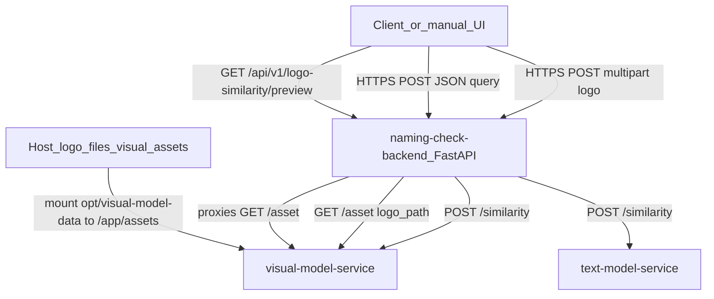

> **Примечание**: Этот документ был создан с помощью ИИ (AI-generated).  
> При внесении изменений вручную, пожалуйста, сохраняйте эту пометку или обновляйте её соответствующим образом.

# Архитектура системы проверки неймингов

**Сервис проверки нейминга**  
*Индустриальный проект МТС*

Каноническое описание архитектуры для `system_analysis` находится в этом файле. Корневой [`system_architecture.md`](../system_architecture.md) — только указатель.

---

## Текущая реализация в репозитории (MVP тестового стенда)

В коде backend сейчас экспонируется **узкий контур similarity-search** и приём webhook Stage 2, без публичных Stage1-ручек регистрации / нарушения / pairwise logo comparison.

- Прикладные контракты и пути: [api_contracts.md](api_contracts.md).
- Параметры деплоя (порты, монтирование каталогов): [backend/.github/workflows/deploy-test-stand.yml](../../backend/.github/workflows/deploy-test-stand.yml).

### Поток: синхронный similarity



### Развёртывание тестового стенда (Docker)

Три контейнера в сети `naming-check-net`. Наружу публикуется только backend; порты sidecar привязаны к `127.0.0.1` хоста.

| Сервис | Типичный хост-порт (снаружи) | Артефакты на хосте |
| --- | --- | --- |
| `naming-check-backend` | `:8000` (настраивается) | `.env.runtime` через workflow |
| `visual-model-service` | `127.0.0.1:9000` | `/opt/visual-model-models` → `/app/models` (`.pt`, `.csv`) |
| | | `/opt/visual-model-data` → `/app/assets` (дерево файлов логотипов под путями из CSV, напр. `data/logos/...`) |
| `text-model-service` | `127.0.0.1:9100` | `/opt/text-model-models` → `/app/models` |

OpenAPI интерактивно: `GET /docs`, `GET /redoc`, `GET /openapi.json` на корне приложения backend.

### Компоненты MVP (фактические)

| Компонент | Роль |
| --- | --- |
| **naming-check-backend** | HTTP API, прокси в sidecars (`httpx`), CORS для локальных UI при необходимости, webhook handler Stage 2. |
| **visual-model-service** | Поиск top-K похожих логотипов по предвычисленным эмбеддингам; отдача файла по относительному `logo_path` для preview (`GET /asset`). |
| **text-model-service** | Поиск top-K похожих названий по текстовому индексу. |

---

## Целевая архитектура продукта (видение ТЗ)

Далее — **продуктовая цель**, которая **не полностью** отражена в текущем публичном API. Она сохранена для системного контекста, ТЗ и будущего развития.

Система предназначена для автоматической проверки нейминга и снижения нагрузки на юридический отдел. В полной постановке предполагаются сценарии:

- проверка нового текстового нейминга на возможность регистрации в РФ;
- автоматическая проверка неправомерного использования товарного знака;
- расширение на сравнение логотипов и объединённые обозначения.

На тестовом стенде **частично** реализован только similarity-слой (лого + текст) через sidecars.

### Высокоуровневая схема (целевая)

```
┌─────────────┐
│   Lawyer    │
└──────┬──────┘
       │
┌──────▼──────┐
│  REST API  │
└──────┬──────┘
       │
┌──────▼──────────────────┐
│ Naming Check Service    │
└──────┬──────────────────┘
       │
┌──────▼─────────────────────────────┐
│         Data Storage               │
│  - Naming Database                 │
│  - Embedding Model                 │
│  - Embedding Dataset               │
│  - Search Indexes                  │
│  - Preprocessed Naming Store       │
└────────────────────────────────────┘
```

### Основные компоненты (целевые)

**REST API.** Точка входа: валидация, оркестрация сценариев, синхронный внутренний результат Stage 1, приём асинхронных обновлений Stage 2 через webhook.

**Naming Check Service.** Координация проверки: поиск кандидатов, многомерные метрики сходства, top-200, подготовка данных для юриста.

**Data Storage.** БД товарных знаков (PostgreSQL), векторные и лексические индексы (в ТЗ упоминается ClickHouse и др.), предобработанные обозначения, офлайн-артефакты.

### Пошаговый процесс (целевой, текстовая регистрация)

1. Юрист отправляет нейминг и классы МКТУ (и тип сценария).
2. API валидирует и передаёт в сервис проверки.
3. Сервис: предфильтрация по МКТУ, семантический поиск по эмбеддингам, фонетический/лексический поиск по индексам, обогащение из БД, использование предобработанных форм.
4. Сравнение и ранжирование: агрегированный процент сходства, юридические правила, top-200.
5. Возврат внутреннего результата; при необходимости — постановка внешнего Stage 2.

### Асинхронный внешний этап (целевой Stage 2)

- Внешний поиск после внутреннего ответа.
- Доставка только через `webhook` на backend.
- Допустимы частичные и неупорядоченные батчи; дедупликация по `naming + MKTU` (как в ТЗ).

---

## Ключевые особенности (смесь MVP и целевого)

- **Офлайн-развёртывание (цель)**: работа во внутреннем контуре без обращений в интернет в рантайме.
- **Предвычисленные эмбеддинги**: реализовано в sidecars для топ-K по статическим индексам.
- **Разделение на сервисы**: на стенде — backend + два CPU sidecar; целевая прод-архитектура может включать очередь, worker внешнего поиска и др. — см. legacy/target диаграммы в [`diagrams/`](../diagrams/).

---

## Результат для юриста (целевой продукт)

- До порядка 200 конфликтующих или близких обозначений по степени риска, с процентами и при необходимости разложением по типам сходства.
- Отдельные сценарии нарушения и логотипов — в продуктовой модели.

---

## Технологические и нефункциональные ограничения

- Стек в ТЗ: `Python 3.10–3.11`, `PostgreSQL`, `ClickHouse`, `Docker`; целевая GPU — `NVIDIA A100`.
- NFR из ТЗ: точность порога, SLA внутреннего ответа и Stage 2, доступность 99.5–99.9%, мониторинг async-контура.

Тестовый стенд: CPU-only sidecars без обязательного GPU для similarity MVP.

### Централизованное логирование (план)

**ELK Stack 8.17.x** (Elasticsearch + Filebeat + Kibana, без Logstash) на **том же VPS**: JSON-логи из stdout контейнеров, retention **1 день**, Kibana на `127.0.0.1:5601` (SSH-туннель), автозапуск через Docker Compose в [`backend/.github/workflows/deploy-test-stand.yml`](../../backend/.github/workflows/deploy-test-stand.yml). Data view в Kibana — вручную (`logs-naming-check-*`). Подробности: [logging_elk_plan.md](logging_elk_plan.md).

---

## Связь с Ubiquitous Language

Термины: [Ubiquitous Language](ubiquitous_language.md). Учитывайте расхождение: часть терминов описывает **целевой** домен Stage1/2; **текущий** контур в коде ближе к «similarity proxy + webhook inbox».

---

## История изменений

- **2024**: Первая версия архитектуры по требованиям и C4 container.
- **2024 (ТЗ)**: Нарушения, офлайн, многоканальный поиск, предобработка, логотипы.
- **2026**: Зафиксирован тестовый стенд с sidecars и монтированием моделей / датасета логотипов.
- **2026 (актуализация)**: Разведены **текущий MVP API** и **целевая продуктовая архитектура**; публичные Stage1 endpoints сняты с backend до появления реализации.
- **2026-06-03**: Добавлен план централизованного логирования ELK — [logging_elk_plan.md](logging_elk_plan.md).
- **2026-06-03**: Реализованы ELK на тестовом стенде и JSON-логирование в backend/sidecars.
